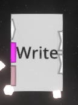

# DisableCustomConnectPoint

A [NeosModLoader](https://github.com/zkxs/NeosModLoader) mod for [Neos](https://neos.com/) that does disable custom input/output attributes for LogiX node; such as IValue\<T\> in Write,Increment,Decrement,Tween...

## Relavent Issue

I created an issue: [Neos-Metaverse/NeosPublic#3486](https://github.com/Neos-Metaverse/NeosPublic/issues/3486)

## Installation

1. Install [NeosModLoader](https://github.com/zkxs/NeosModLoader).
1. Place [DisableCustomConnectPoint.dll](https://github.com/kazu0617/DisableCustomConnectPoint/releases/latest/download/DisableCustomConnectPoint.dll) into your `nml_mods` folder. This folder should be at `C:\Program Files (x86)\Steam\steamapps\common\NeosVR\nml_mods` or `C:\Neos\app\nml_mods` for a default install. You can create it if it's missing, or if you launch the game once with NeosModLoader installed it will create the folder for you.
1. Start the game. If you want to verify that the mod is working you can check your Neos logs.

## ScreenShots

